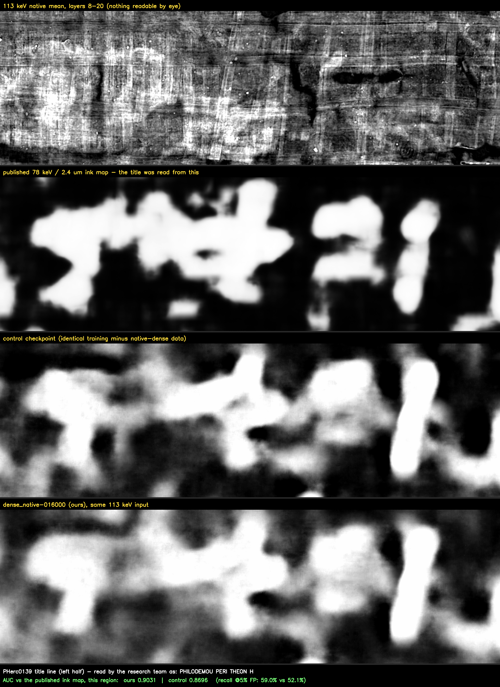

# Native ink detection, measured and hardened
> Code mirror. The model weights live on Hugging Face: https://huggingface.co/Nieuwlaar/ink9um-dense-native

> Code is also mirrored on GitHub: https://github.com/Nieuwlaar/ink9um-dense-native


Author: Erwin Nieuwlaar (GitHub: Nieuwlaar)

Dense pseudo-labels on **native-resolution scans** lift the best public ink
model by four points on the harder of two segments it has never seen, and a
matched control shows the gain comes from the native-scan data rather than the
extra training.
Around that result this repo ships the measurement apparatus that made it
checkable: two benchmarks frozen before use, independent replications of the
month's two community results (one of which turned up a recipe that must never
be shipped), and standalone physics-based false-positive filters.

The month's arc on one fully held-out segment, the PHerc0139 title bar:

| step | title AUC |
|---|---|
| released `ink_9um` checkpoint (s42-75k) | 0.8135 |
| + checkpoint soup | 0.8402 |
| + z-window ensemble | 0.8552 |
| KLAVIS dense pseudo-label training (his `dense9um-w016excluded-step075000`, the strongest of the public checkpoints on this benchmark; independent replication) | 0.9147 |
| **+ dense native-scan pseudo-labels (this repo's training run)** | **0.9548** |

Everything here uses public data only: the MIT-licensed `ink_9um` checkpoints
and labels, KLAVIS's public `ink9um-dense` checkpoints, and PHerc0139 segments
from the open-data S3 bucket.

## What is in here

| path | what |
|---|---|
| `weights/` | the two headline checkpoints as bare safetensors state_dicts (`soup42_last4`, `dense_native_016000`) + `VERIFY.md` with sha256s and the strip re-verification |
| `build_soup.sh`, `make_soup.py` | bit-identical checkpoint-soup rebuild |
| `zavg_infer.sh` | z-window ensemble inference |
| `vetoes.py` | standalone physics-based false-positive filters |
| `official-eval/` | the official-validation-mask pipeline (+ `official_eval.csv`, `official_eval_v2.csv`) |
| `native-eval/` | `native_bench.py` (the frozen held-out native benchmark and the blank-segment control) + `RESULTS_full.csv` (every native-benchmark number in this README, one row per model and segment, with a per-row source) |
| `training/` | the dense native-scan training extension: configs, label-building scripts, `BENCHMARK.csv`, `REPRODUCE.md` |
| `fine-tune/` | the negative result: sparse single-scroll fine-tuning |
| `figures/` | Figure 1 (title-line, native 113 keV, four ways) + measured caption + `fig1_metrics.py` |

## Quick start: the zero-training recipe

```bash
# 1. Build the soup checkpoint (downloads 4 released checkpoints, ~0.6 GB)
./build_soup.sh checkpoints soup42_last4.pth

# 2. Run z-ensemble inference (from villa's ink-detection directory,
#    branch merge-ink-pipelines, so koine_machines resolves)
PY="uv run python" ./zavg_infer.sh surface_volume.zarr soup42_last4.pth out/myseg 0:20 3:23 5:25 8:27
#    -> out/myseg_zavg_prob.npy  (float ink probabilities in [0,1])

# 3. Optional: filter false positives against the CT physics
./vetoes.py apply --prob out/myseg_zavg_prob.npy --stack surface_volume.zarr \
    --raw-from-stack --out out/myseg_veto
```

Window recipes: `0:20 3:23 5:25 8:27` for native 28-slice surface volumes,
`0:17 1:18 2:19 3:20 4:21` for aligned 21-slice pooled inputs. Cost: one
inference run per window.

## Using the shipped weights

`weights/` holds the two headline checkpoints as bare safetensors
state_dicts: no optimizer state, no training config.
`koine_machines.inference.infer` expects a `.pth` payload with the model
config attached; rebuild one in three lines:

```python
import json, torch
from safetensors.torch import load_file
torch.save({"model": load_file("weights/dense_native_016000.safetensors"),
            "config": json.load(open("training/configs/train_dense_native.json")),
            "step": 16000}, "dense_native_016000.pth")
```

For the soup, `./build_soup.sh` rebuilds the identical `.pth` from the
released checkpoints (`weights/soup42_last4.safetensors` is verified
bit-identical to that rebuild's tensors), or attach the config of any
released seed-42 checkpoint the same way. Checksums and the
post-strip re-verification are in `weights/VERIFY.md`.

To reproduce or extend the trained model instead, see `training/REPRODUCE.md`.

---

# 1. Benchmarks first: two rulers, frozen before use

Every number below is measured on one of two benchmarks, both fixed before any
of the models in this repo existed.

**The official validation masks.** The `ink_9um` dataset defines validation
masks on three segments (PHerc0139 w016, PHerc0814 46527, PHerc1667 w029):
regions of training segments whose pixels were excluded from supervision.
Inputs are rebuilt from the public 2.399 µm surface volumes exactly as the
dataset README records (level-2 pyramid, 84 centered z planes pooled 4x to 21
slices; villa's `prepare_9um_isotropic_input.py`). Score: tie-aware ROC-AUC
at the annotated slice, on validation-mask pixels minus supervision pixels.
Limit: these are held-out *pixels* of segments whose other pixels were
trained on, so this measures within-distribution generalization.

**The fully held-out native benchmark.** PHerc0139 was scanned at several
X-ray energies. At 78 keV the ink is strong and the organization's released
ink maps show the text clearly; at the native 113 keV / 9.362 µm resolution it
is much fainter. So I score models on the 113 keV surface volume of segments
**completely outside every `ink_9um` label set** (the title bar and winding
w024) against confident-ink / confident-background classes taken from the
public 78 keV maps of the same segments.

Two controls back it. **Misregistration**: shifting the classes ~2 mm or
rotating them 90° collapses the AUC to 0.62–0.70, so the score does not ride
on a region or texture shortcut. **Layer order**: running the title with the
z-layers reversed collapses 0.81 → 0.51. The signal is orientation-specific,
as a real ink response should be, not symmetric texture.

**The standing caveat**, which applies to every native number in this repo:
the reference classes derive from the org's released 78 keV model maps, not
from human ground truth. That is why w024 additionally carries an
*independent* reference (a 59 keV / 1.1 µm map from a different model on a
different scan) and a `student_over_ceiling` ratio that flags a model
agreeing with the 78 keV reference suspiciously better than the independent
59 keV reference does (flag threshold 1.02).

Harness: `native-eval/native_bench.py` reproduces every native number from the
S3 data plus a prediction map; `official-eval/` does the same for the masks.
`native-eval/RESULTS_full.csv` collects every native-benchmark number quoted
in this README in machine-readable form (the `lab:` sources are the archived
run logs the numbers were transcribed from; `training/BENCHMARK.csv` rows are
in this repo).

---

# 2. Replication 1: the checkpoint soup, confirmed and quantified

Average the last four seed-42 checkpoints into one "soup" model, and average
predictions over the possible z windows: zero training cost. The idea came up
in the community and the maker of the checkpoints invited experiments;
Armando replicated the gain concurrently. What I add is the independent
confirmation on two benchmarks, the quantification, and the tooling:
`build_soup.sh` rebuilds `soup42_last4.pth` bit-identically from the released
files (uniform average of seed-42 steps 40k, 50k, 60k, 75k).

**On the official validation masks:**

| segment | released s42-75k | soup42 | released + zavg5 | soup42 + zavg5 |
|---|---|---|---|---|
| pherc0139-w016 | 0.7740 | 0.8359 | 0.7987 | 0.8485 |
| pherc0814-46527 | 0.8744 | 0.8810 | 0.8710 | 0.8816 |
| pherc1667-w029 | 0.8702 | 0.8933 | 0.8937 | 0.9074 |
| **mean** | **0.8395** | **0.8701** | **0.8545** | **0.8792** |

Mean AUC 0.8395 → 0.8792 (+4.0 points), the soup winning on every segment
under every window scheme; micro-averaged over all 721,550 pooled eval pixels:
0.8486 → 0.8769.

*Numbers are against the corrected labels/masks the maintainers re-uploaded on
2026-08-18 (the earlier upload had seam regions masked off). Against the
original masks the mean was 0.8385 → 0.8787; the correction moved every cell
by ≤0.003 and changed no ranking. Both score files ship here
(`official_eval.csv`, `official_eval_v2.csv`).*

zavg5 = pixel mean of the five 17-of-21 z windows (the checkpoints consume 17
slices, so a 21-slice input has five windows; the default is the center one).
Two of the three segments were run on 64-aligned crops around the validation
region to save bandwidth; because patch normalization is local and the
sliding-window grid is alignment-preserved, in-mask crop predictions are
bit-identical to full-frame inference (verified exactly on pherc0814-46527:
max abs diff 0 over all 161,051 validation pixels).

**On the fully held-out native benchmark**, the same recipe gains +4.2 / +2.6
points:

| recipe | title AUC | w024 AUC | w024 vs 59 keV (indep.) |
|---|---|---|---|
| released s42-75k, default window | 0.8135 | 0.8724 | 0.8507 |
| soup42 | 0.8402 | 0.8926 | 0.8696 |
| soup42 + z-ensemble | **0.8552** | **0.8984** | **0.8789** |

(z-ensemble: mean over windows 0:20, 3:23, 5:25, 8:27 on title; 0:20, 3:23,
5:25 on w024. Shallower windows score better on their own; the average beats
every single window.)

# 3. Replication 2: dense pseudo-label training, tested out of distribution

KLAVIS (DomRusso2, `ink9um-dense`) retrained the `ink_9um` recipe with dense
teacher pseudo-labels, ~83% of the canvas overall supervised (57–89% per
segment) instead of the 1–6%
manual coverage, and reported large gains on the official validation crops.
That is a within-distribution measurement of his own labels' effect, so I ran
his shipped checkpoints on my frozen native benchmark, which none of his
models ever saw, across a change of scan energy, resolution and metric:

| model | title AUC | w024 AUC | w024 vs 59 keV (indep.) |
|---|---|---|---|
| KLAVIS control (manual labels, his retrain) | 0.8268 | 0.8761 | 0.8465 |
| **KLAVIS dense (his shipped w016-excluded)** | **0.9147** | **0.9538** | **0.9088** |
| soup42 + z-ensemble (best single-seed inference recipe, above) | 0.8552 | 0.8984 | 0.8789 |

His control lands close to the released checkpoint (0.8268 / 0.8761 vs its
0.8135 / 0.8724), so his pipeline reproduces the official model's level and
the +0.088 / +0.078 delta is dominated by the label density, not his training
setup. That is +0.060 / +0.055 over soup42 + z-ensemble, my best single-seed
inference recipe. **The replication stands.**

The conservative reading is the independent 59 keV column: +0.062 over his
control there too, so the gain is not merely "agrees more with the
canonical-2.4 µm teacher family".

## The failure mode found on the way: do not weight-average across seeds

Souping the last four checkpoints of *one* run works. Souping eight
checkpoints across *two seeds* does not:

| recipe | title AUC | w024 AUC |
|---|---|---|
| soup42 (one trajectory) | 0.8402 | 0.8926 |
| soup43 (one trajectory) | 0.8389 | 0.8874 |
| **8-checkpoint cross-seed weight soup** | **0.4856** | **0.4937** |
| mean(soup42 map, soup43 map), prediction level | 0.8657 | 0.9119 |
| mean(soup42, soup43) + z-ensemble | **0.8716** | **0.9153** |

Chance is 0.5. Independently initialized runs land in different loss basins,
so averaging their weights destroys the model. Weight-space souping is only
valid along a single training trajectory, and a cross-seed weight soup must
never be shipped. The correct cross-seed combination is prediction-level, and
it is the best recipe available using official weights only (the two seeds'
maps correlate only r = 0.68 / 0.75, which is why averaging them helps more
than adding checkpoints along one trajectory).

# 4. The new result: dense pseudo-labels on the native scans themselves

Dense labels are what made the difference above, and KLAVIS's dense set is
built on aligned ~9.6 µm renders. The one ingredient it lacks is dense
supervision on the **native 113 keV scans** that the hard segments actually
come from. So I extended his exact recipe with it and ran a matched control.

**Setup, all public.** His seven dense-label segments are rebuilt from the
org's published canonical-2.4 µm ink maps, re-derived with his published
recipe rather than taken from his tar archive; the rebuild reproduces his
coverage table to the decimal on six of seven segments (the seventh differs
by 0.1 point), which also confirms the org's published maps
are his teacher family and is the stronger provenance check. My addition: dense
labels on ten native PHerc0139 segments (w030, w032, w033, w034, w040, w041,
w043, w046, w049, w050) from the org's public 78 keV companion maps resized
onto the 113 keV grid, with the ink threshold calibrated per segment against
the five manual native label sets (median 0.184; manual labels win wherever
they exist). Coverage 84–88% of canvas, 415k training patches against 5.8k
from all the sparse native labels, 72x the sparse density.

The four benchmark segments (title, w024, w047, w053) are never trained on,
asserted in the config generator so the run fails loudly rather than quietly
contaminating the benchmark.

**The control is matched**: the identical config minus the ten native-dense
representations. Both runs initialize from KLAVIS's best public checkpoint,
same optimizer, same 20 000 steps, same relative batch quotas for his 29
representations (scaled from 29/22/11/2 per batch of 64 to 20/16/8/1 to make
room for the 19/64 native slice). The two configs differ in four keys, and
`training/` ships both so you can diff them.

**Result on the frozen held-out benchmark**, for every checkpoint of both runs:

| step | treatment title | control title | treatment w024 | control w024 |
|---|---|---|---|---|
| 4 000 | 0.9510 | 0.9084 | 0.9680 | 0.9529 |
| 8 000 | 0.9541 | 0.9098 | 0.9694 | 0.9542 |
| 12 000 | 0.9485 | 0.9023 | 0.9678 | 0.9523 |
| **16 000** | **0.9548** | 0.9149 | **0.9685** | 0.9545 |
| 20 000 | 0.9539 | 0.9094 | 0.9692 | 0.9528 |

The ranges never overlap on either segment. The control sits at the level of
its initialization (0.9147 / 0.9538) for all 20 000 steps, so the gain is the
native-scan data and not the extra training. Best checkpoint, step 16 000:
**0.9548 / 0.9685**. That is +4.0 / +1.5 points over the best public
checkpoint, and +8.3 / +5.3 over the best recipe using official weights alone.

The independent 59 keV reference agrees on direction: 0.9149 for the treatment
against 0.9085 for the control at step 16 000.

Here is what the numbers look like on papyrus. The title-line region, native
113 keV input, with the published 78 keV map, the control and the treatment
side by side (measured caption in `figures/fig1_caption.md`):



**Caveat.** The pseudo-label teacher belongs to the
same 78 keV family as the benchmark's main reference, so the vs-78 gains are
an **upper bound**. That is exactly why the 59 keV cross-check is reported
next to them, and why the cloning ratio is reported at all:
`student_over_ceiling` sits at 1.018 at step 16 000 (1.018–1.020 across the
five treatment checkpoints), under the 1.02 flag. The model is not collapsing
onto its teacher, but it is close enough to the line that the vs-78 number
should never be quoted alone. Misregistration is 0.70–0.77 for the treatment, above
the 0.60 gate but higher than the official checkpoints' 0.60–0.69, consistent
with broader supervision carrying more low-frequency region prior.

Both runs together cost about five hours on two cloud 4090s, roughly $4 of
compute. `training/REPRODUCE.md` has the exact steps, `training/BENCHMARK.csv`
the full log. The best treatment checkpoint (step 16 000) ships in `weights/`
as a bare safetensors state_dict, re-verified after stripping (see
`weights/VERIFY.md`); everything needed to rebuild it from scratch ships too.

## The negative result that motivated it: single-scroll fine-tuning hurts

The obvious cheap adaptation is fine-tuning on whatever labels the target
scroll already has. I tested it first: fine-tune soup42 on the five *sparse*
native PHerc0139 label sets (AdamW 2e-5, batch 64, 12k steps, config in
`fine-tune/native_ft.json`, otherwise the released recipe).

| checkpoint | title AUC | w024 AUC |
|---|---|---|
| soup42 (start) | 0.8402 | 0.8926 |
| fine-tuned 3k steps | 0.8125 | 0.8410 |
| fine-tuned 6k steps | 0.8018 | 0.8253 |
| fine-tuned 9k steps | 0.7984 | 0.8189 |
| fine-tuned 12k steps | 0.7994 | 0.8191 |

Every fine-tuned checkpoint sits well below the start on both segments. Even
50 steps already cost ~0.02 AUC. The mixed-scroll balanced sampling of the original recipe is doing real
work; re-weighting toward one scroll throws it away. Density, not proximity,
is what makes native-scan supervision help: the successful run above keeps the
full corpus in every batch and adds the native data as a 30% slice rather than
a replacement. Full log: `fine-tune/BENCHMARK.csv`.

---

# 5. False positives, measured and filtered with physics

A score can look good while the maps stay visually untrustworthy, because
false positives cluster on damage that *looks* like ink to a texture model. I
measured this on a deliberately chosen pair of PHerc0139 segments: w047
(ink-bearing) to set the operating point, w053 (known blank) to count false
alarms. At the threshold that recalls 80% of the 78 keV ink components on
w047, the released checkpoint flags **26.9%** of the blank segment's papyrus
(`native_bench.py fp-control` reproduces this).

`vetoes.py` attacks that with filters that check each detection against the CT
data itself. No model, no training, applicable to any ink probability map:

1. **CT-void veto**: real ink sits on papyrus; a detection darker than its
   surroundings in the mid-depth CT is a void or damage shadow.
2. **Raw-darkness sign test**: carbon ink is darker than clean papyrus; each
   detection must be darker than a wide elliptical annulus from which all
   detected pixels are excluded (small square rings are exploitable by fold
   shadows, so that exclusion matters).
3. **Line-pitch test** (reported, never vetoes): text sits in rows at
   2–4.5 mm pitch; a Monte-Carlo test says whether surviving detections are
   row-organized. On the blank segment it correctly reports "not
   row-organized" (p = 0.96). Treat it as one-sided evidence: on the
   ink-bearing control it also stays non-significant at this operating point
   (real components mixed with scattered survivors dilute the grid fit), so
   a high p argues against text while a low p is only suggestive.
4. **Depth-band gate** (documented concept): ink lives in a narrow band of
   layers at the papyrus surface, so with a per-layer prediction stack,
   detections peaking far from that band can be rejected. Not implemented
   here because it needs the full layer stack; the three filters above run
   from one probability map, one surface volume, and one composite.

Measured on the released checkpoint's maps at threshold 0.30 (min area
300 px, defaults of `vetoes.py`):

| stage | w053 (blank) flagged | w047 teacher-component recall |
|---|---|---|
| thresholded map | 12.2% | 49.3% |
| + min-area components | 12.1% | 48.8% |
| + CT-void veto | 11.6% | 48.0% |
| + raw-darkness sign test | **3.7%** | 16.1% |

Recall-column definition, so it is reproducible: teacher components are
connected components of the w047 78 keV map above half its maximum, minimum
300 px; a component counts as recalled when at least 10% of its pixels survive
the stage. The w053 column and the line-pitch p-value reproduce from
`vetoes.py` alone.

The reading: the void veto is nearly free, and the darkness test removes most
of the remaining blank-segment false area, at a real recall cost at this
energy, because faint 113 keV ink is not always measurably darker than its
background. Both filters are threshold-parameterized, so you choose the
trade-off; the defaults are the measured operating points above.

This is also a comment on the metric gap: pixel AUC barely moves when a map
hallucinates on damage, but a blank-segment flag rate does. A better model and
a lower false-alarm rate are separate axes, and this repo measures both.

A further cheap filter is agreement between independent detectors: keep only
components that a second, differently-trained model also marks. Any second
detector works; a natural choice at ~8–9 µm is the repaired
`resnet50_7.9um_scroll1_frags` checkpoint
(https://huggingface.co/Nieuwlaar/resnet50_7.9um_scroll1_frags-repaired).

# 6. Limitations

- The native benchmark's reference is a released 78 keV model map, not human
  ground truth; the official-masks benchmark is within-distribution. They
  complement each other, and every recipe here wins on both. But for the
  trained model the teacher is inside the reference's family, so its vs-78
  margin is an upper bound (see the caveat in section 4).
- The training result is one seed from one initialization. A replicate started
  from a different basin (soup42) is the obvious follow-up and has not been
  run.
- The false-positive numbers are measured on one scroll's blank/ink pair at
  one energy; the darkness veto in particular is aggressive at 113 keV. Treat
  the defaults as measured starting points, not universal constants.
- The z-ensemble multiplies inference time by the number of windows.
- Better AUC is not yet readable text: on these native 113 keV segments the
  improved maps show letter-shaped strokes, not transcribable lines.

# 7. Reproduce

```bash
# soup (bit-identical rebuild)
./build_soup.sh checkpoints soup42_last4.pth

# official validation masks (needs GPU; labels from the HF bucket, volumes from S3)
cd official-eval
python scripts/fetch_bucket_labels.py pherc0814-46527 data/labels    # + the other 2 segments
python scripts/fetch_s3_level2.py <zarr_url_from_dataset_README> data/src/<seg>_level2.zarr
python scripts/build_crop_direct.py <seg>                            # pooled validation crop
MDIR=/path/to/checkpoints PY="uv run python" ./run_infer.sh          # from villa/ink-detection
python scripts/collect_results.py                                    # -> official_eval.csv

# native benchmark (segment dirs pulled from the open-data S3 bucket:
# surface-volumes/9.362um-1.2m-113keV-*.zarr -> <dir>/zarr113,
# ink-detection/*78keV*autoresearch*.tif -> <dir>/)
PY="uv run python" ./zavg_infer.sh <dir>/zarr113 soup42_last4.pth out/title 0:20 3:23 5:25 8:27
python native-eval/native_bench.py metrics --seg-dir <dir> --pred out/title_zavg_prob.npy

# false-positive control + vetoes
python native-eval/native_bench.py fp-control \
    --ink-seg-dir <w047_dir> --ink-pred out/w047_prob.npy \
    --blank-seg-dir <w053_dir> --blank-pred out/w053_prob.npy
./vetoes.py apply --prob out/w053_prob.npy --stack <w053_dir>/zarr113 \
    --valid <w053_dir>/valid113.npy --raw-from-stack --th 0.30 --out out/w053_veto

# the dense native-scan training run (two arms, ~5 h on two cloud 4090s)
cat training/REPRODUCE.md
```

Segment IDs: title `20260422000000-title_2026042222_zmid_flatboi`, w024
`20260215000000-w024_2026021572`, w047 `20260206000001-w047_2026020613`,
w053 `20260220000000-w053_2026022021`, under
`s3://vesuvius-challenge-open-data/PHerc0139/segments/` (anonymous access).
